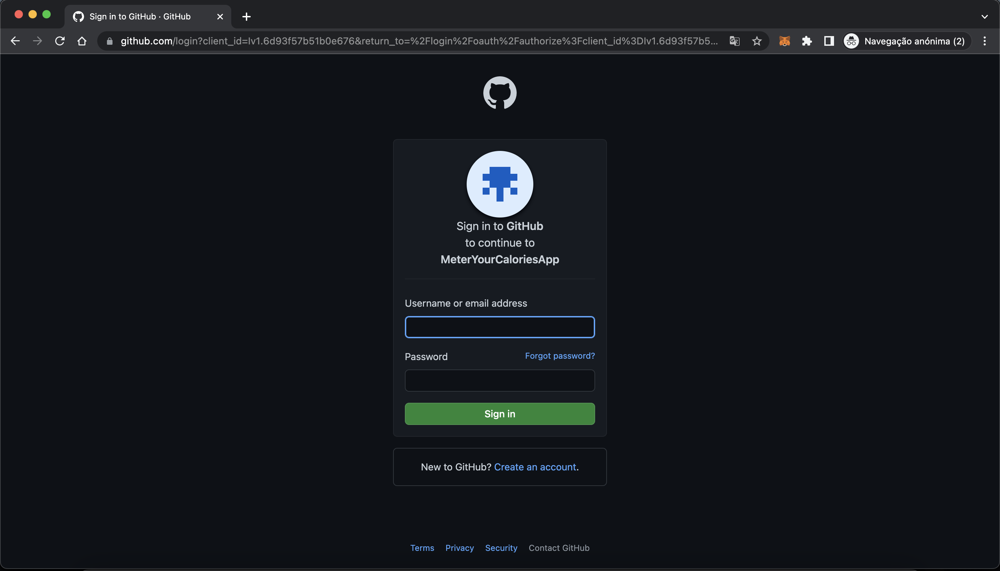

# Meter Your Calories Platform

## User Service

This service intends to solve all authentication, authorization and user management.

Initially, in the first approach, it was thought to use the OAuth 2.0 process to authorize employees using Azure Active Directory.
After a few failed attempts, as you can see in the commits, I decided to take the approach of using github's OAuth 2.0.

After some changes in strategy when invoking any feature of the service's API, it was already necessary to indicate the github credentials to be able to use the service. (As you can see in the figure).

But another problem occurred, the github callback process was not working as it should, not redirecting after authorization to the intended endpoint.

For user management, it was intended to obtain user information and create an entry for that user in the database after the authentication and authorization process.

